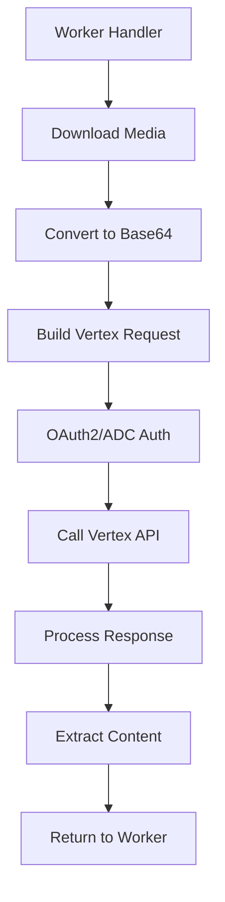

# Plano de Implementação Vertex AI - Correção Completa

## 📋 Resumo Executivo

A implementação atual do Vertex AI está **completamente incorreta** e precisa ser **reescrita do zero**. Este documento apresenta um plano estruturado em 7 fases para implementar corretamente a integração com a API Vertex AI do Google Cloud.

**Problemas Críticos Identificados:**
- ❌ Usa Pub/Sub em vez de chamadas diretas à API
- ❌ Estruturas de dados incompatíveis
- ❌ Autenticação ausente
- ❌ Processamento de mídia inadequado
- ❌ Configuração de modelos inexistente

## 🏗️ Arquitetura Proposta



## 📦 Fase 1: Estruturas de Dados (Prioridade: CRÍTICA)

### 1.1 Request Structures

```rust
// src/services/vertex/models.rs

use serde::{Deserialize, Serialize};

#[derive(Debug, Serialize, Deserialize)]
pub struct VertexAIRequest {
    pub contents: Vec<Content>,
    #[serde(skip_serializing_if = "Option::is_none")]
    pub generation_config: Option<GenerationConfig>,
    #[serde(skip_serializing_if = "Option::is_none")]
    pub safety_settings: Option<Vec<SafetySetting>>,
}

#[derive(Debug, Serialize, Deserialize)]
pub struct Content {
    pub role: String, // "user" or "model"
    pub parts: Vec<Part>,
}

#[derive(Debug, Serialize, Deserialize)]
#[serde(untagged)]
pub enum Part {
    Text { text: String },
    InlineData { inline_data: InlineData },
}

#[derive(Debug, Serialize, Deserialize)]
pub struct InlineData {
    pub mime_type: String,
    pub data: String, // Base64 encoded
}

#[derive(Debug, Serialize, Deserialize)]
pub struct GenerationConfig {
    #[serde(skip_serializing_if = "Option::is_none")]
    pub temperature: Option<f32>,
    #[serde(skip_serializing_if = "Option::is_none")]
    pub top_p: Option<f32>,
    #[serde(skip_serializing_if = "Option::is_none")]
    pub top_k: Option<i32>,
    #[serde(skip_serializing_if = "Option::is_none")]
    pub max_output_tokens: Option<i32>,
    #[serde(skip_serializing_if = "Option::is_none")]
    pub response_mime_type: Option<String>,
}
```

### 1.2 Response Structures

```rust
#[derive(Debug, Deserialize)]
pub struct VertexAIResponse {
    pub candidates: Vec<Candidate>,
    #[serde(skip_serializing_if = "Option::is_none")]
    pub usage_metadata: Option<UsageMetadata>,
}

#[derive(Debug, Deserialize)]
pub struct Candidate {
    pub content: Content,
    #[serde(skip_serializing_if = "Option::is_none")]
    pub finish_reason: Option<String>,
    #[serde(skip_serializing_if = "Option::is_none")]
    pub safety_ratings: Option<Vec<SafetyRating>>,
}

#[derive(Debug, Deserialize)]
pub struct UsageMetadata {
    pub prompt_token_count: i32,
    pub candidates_token_count: i32,
    pub total_token_count: i32,
}
```

## 🔐 Fase 2: Autenticação (Prioridade: CRÍTICA)

### 2.1 Google Application Default Credentials (ADC)

```rust
// src/services/vertex/auth.rs

use google_cloud_auth::{Credential, CredentialConfig};
use google_cloud_token::{TokenSourceProvider, TokenSource};

pub struct VertexAuth {
    credential: Credential,
    token_source: Box<dyn TokenSource>,
}

impl VertexAuth {
    pub async fn new() -> Result<Self, Box<dyn std::error::Error>> {
        // Configurar escopos necessários
        let config = CredentialConfig {
            scopes: Some(vec![
                "https://www.googleapis.com/auth/cloud-platform".to_string(),
                "https://www.googleapis.com/auth/generative-language".to_string(),
            ]),
            ..Default::default()
        };

        // Obter credencial (ADC ou Service Account)
        let credential = Credential::find_default(config).await?;

        // Criar token source
        let token_source = credential.token_source(
            "https://vertexai.googleapis.com/"
        )?;

        Ok(Self {
            credential,
            token_source,
        })
    }

    pub async fn get_token(&self) -> Result<String, Box<dyn std::error::Error>> {
        let token = self.token_source.token().await?;
        Ok(token.access_token)
    }
}
```

### 2.2 Headers de Autenticação

```rust
pub fn build_auth_headers(token: &str) -> HeaderMap {
    let mut headers = HeaderMap::new();
    headers.insert(
        "Authorization",
        format!("Bearer {}", token).parse().unwrap()
    );
    headers.insert("Content-Type", "application/json".parse().unwrap());
    headers
}
```

## 📸 Fase 3: Processamento de Mídia (Prioridade: ALTA)

### 3.1 Download e Conversão

```rust
// src/services/vertex/media.rs

use base64::{Engine as _, engine::general_purpose::STANDARD};
use reqwest;

pub struct MediaProcessor;

impl MediaProcessor {
    pub async fn process_media_url(url: &str) -> Result<InlineData, Box<dyn std::error::Error>> {
        // Download do arquivo
        let client = reqwest::Client::new();
        let response = client
            .get(url)
            .timeout(Duration::from_secs(30))
            .send()
            .await?;

        // Verificar content-type
        let content_type = response
            .headers()
            .get("content-type")
            .and_then(|v| v.to_str().ok())
            .unwrap_or("application/octet-stream")
            .to_string();

        // Validar tipo MIME suportado
        Self::validate_mime_type(&content_type)?;

        // Obter bytes
        let bytes = response.bytes().await?;

        // Verificar tamanho (máx 20MB para Vertex AI)
        if bytes.len() > 20 * 1024 * 1024 {
            return Err("Media file too large (max 20MB)".into());
        }

        // Converter para base64
        let base64_data = STANDARD.encode(&bytes);

        Ok(InlineData {
            mime_type: content_type,
            data: base64_data,
        })
    }

    fn validate_mime_type(mime_type: &str) -> Result<(), Box<dyn std::error::Error>> {
        let valid_types = vec![
            "image/jpeg",
            "image/png",
            "image/gif",
            "image/webp",
            "video/mp4",
            "video/mpeg",
            "video/mov",
            "video/avi",
            "video/x-flv",
            "video/mpg",
            "video/webm",
            "video/wmv",
            "video/3gpp",
            "audio/wav",
            "audio/mp3",
            "audio/aiff",
            "audio/aac",
            "audio/ogg",
            "audio/flac",
            "application/pdf",
        ];

        if valid_types.contains(&mime_type) {
            Ok(())
        } else {
            Err(format!("Unsupported media type: {}", mime_type).into())
        }
    }
}
```

## 🤖 Fase 4: Cliente Vertex AI (Prioridade: ALTA)

### 4.1 Implementação do Cliente

```rust
// src/services/vertex/client.rs

use reqwest::Client;
use serde_json;

pub struct VertexAIClient {
    http_client: Client,
    auth: VertexAuth,
    project_id: String,
    location: String,
    model: String,
}

impl VertexAIClient {
    pub async fn new(
        project_id: String,
        location: String,
        model: String,
    ) -> Result<Self, Box<dyn std::error::Error>> {
        let auth = VertexAuth::new().await?;
        let http_client = Client::builder()
            .timeout(Duration::from_secs(60))
            .build()?;

        Ok(Self {
            http_client,
            auth,
            project_id,
            location,
            model,
        })
    }

    pub async fn generate_content(
        &self,
        request: VertexAIRequest,
    ) -> Result<VertexAIResponse, Box<dyn std::error::Error>> {
        // Construir URL
        let url = format!(
            "https://{}-aiplatform.googleapis.com/v1/projects/{}/locations/{}/publishers/google/models/{}:generateContent",
            self.location,
            self.project_id,
            self.location,
            self.model
        );

        // Obter token
        let token = self.auth.get_token().await?;

        // Serializar request
        let body = serde_json::to_string(&request)?;

        // Log do request
        tracing::debug!("Vertex AI Request URL: {}", url);
        tracing::debug!("Vertex AI Request Body: {}", body);

        // Fazer chamada HTTP
        let response = self.http_client
            .post(&url)
            .header("Authorization", format!("Bearer {}", token))
            .header("Content-Type", "application/json")
            .body(body)
            .send()
            .await?;

        // Verificar status
        let status = response.status();
        let response_text = response.text().await?;

        tracing::debug!("Vertex AI Response Status: {}", status);
        tracing::debug!("Vertex AI Response Body: {}", response_text);

        if !status.is_success() {
            return Err(format!(
                "Vertex AI API error ({}): {}",
                status,
                response_text
            ).into());
        }

        // Deserializar resposta
        let vertex_response: VertexAIResponse = serde_json::from_str(&response_text)?;

        Ok(vertex_response)
    }
}
```

## ⚙️ Fase 5: Service Principal (Prioridade: ALTA)

### 5.1 Refatoração do VertexAIService

```rust
// src/services/vertex.rs (NOVA IMPLEMENTAÇÃO)

use std::sync::Arc;
use tokio::sync::Mutex;

pub struct VertexAIService {
    client: Arc<VertexAIClient>,
    media_processor: MediaProcessor,
    default_prompt: String,
}

impl VertexAIService {
    pub async fn new(
        project_id: String,
        location: String,
    ) -> Result<Self, Box<dyn std::error::Error>> {
        // Usar modelo Gemini 1.5 Pro por padrão
        let model = "gemini-1.5-pro-002".to_string();

        let client = VertexAIClient::new(
            project_id,
            location,
            model,
        ).await?;

        let default_prompt = r#"
Você é um assistente especializado em analisar conversas de WhatsApp e extrair informações relevantes.
Por favor, analise a imagem/vídeo/áudio fornecido e:
1. Descreva o conteúdo principal
2. Identifique qualquer texto visível
3. Extraia informações relevantes para contexto empresarial
4. Sugira uma categoria e subcategoria apropriadas

Formato de resposta esperado:
{
  "description": "Descrição detalhada do conteúdo",
  "extracted_text": "Qualquer texto extraído",
  "category": "Categoria sugerida",
  "subcategory": "Subcategoria sugerida",
  "key_insights": ["insight1", "insight2"],
  "confidence": 0.95
}
"#.to_string();

        Ok(Self {
            client: Arc::new(client),
            media_processor: MediaProcessor,
            default_prompt,
        })
    }

    pub async fn process_media(
        &self,
        media_url: &str,
        custom_prompt: Option<String>,
    ) -> Result<String, Box<dyn std::error::Error>> {
        // 1. Processar mídia
        let inline_data = self.media_processor
            .process_media_url(media_url)
            .await?;

        // 2. Construir request
        let prompt = custom_prompt.unwrap_or_else(|| self.default_prompt.clone());

        let request = VertexAIRequest {
            contents: vec![
                Content {
                    role: "user".to_string(),
                    parts: vec![
                        Part::Text { text: prompt },
                        Part::InlineData { inline_data },
                    ],
                },
            ],
            generation_config: Some(GenerationConfig {
                temperature: Some(0.4),
                top_p: Some(0.95),
                top_k: Some(40),
                max_output_tokens: Some(8192),
                response_mime_type: Some("application/json".to_string()),
            }),
            safety_settings: None,
        };

        // 3. Chamar API
        let response = self.client.generate_content(request).await?;

        // 4. Extrair conteúdo
        let content = response.candidates
            .first()
            .and_then(|c| c.content.parts.first())
            .and_then(|p| match p {
                Part::Text { text } => Some(text.clone()),
                _ => None,
            })
            .ok_or("No text content in response")?;

        Ok(content)
    }
}
```

## 🔌 Fase 6: Integração com Worker (Prioridade: MÉDIA)

### 6.1 Modificações no Worker Handler

```rust
// Alterações em src/handlers/worker.rs

// Em handle_worker(), adicionar processamento de mídia:

if let Some(media) = &payload.message.media {
    if let Some(vertex_service) = &state.vertex {
        match vertex_service.process_media(&media.url, None).await {
            Ok(analysis) => {
                // Parse do JSON retornado
                if let Ok(media_analysis) = serde_json::from_str::<MediaAnalysis>(&analysis) {
                    // Adicionar ao contexto da tarefa
                    task_description = format!(
                        "{}\n\n📸 Análise de Mídia:\n{}",
                        task_description,
                        media_analysis.description
                    );

                    // Adicionar insights aos comentários
                    if !media_analysis.key_insights.is_empty() {
                        comments.push_str(&format!(
                            "\n\n💡 Insights:\n{}",
                            media_analysis.key_insights.join("\n- ")
                        ));
                    }
                }
            }
            Err(e) => {
                tracing::error!("Failed to process media with Vertex AI: {}", e);
                // Continuar sem análise de mídia
            }
        }
    }
}
```

### 6.2 Estrutura de Análise de Mídia

```rust
#[derive(Debug, Deserialize)]
struct MediaAnalysis {
    description: String,
    extracted_text: Option<String>,
    category: Option<String>,
    subcategory: Option<String>,
    key_insights: Vec<String>,
    confidence: f32,
}
```

## 🧪 Fase 7: Testes e Validação (Prioridade: MÉDIA)

### 7.1 Testes Unitários

```rust
// src/services/vertex/tests.rs

#[cfg(test)]
mod tests {
    use super::*;

    #[tokio::test]
    async fn test_auth_token_generation() {
        let auth = VertexAuth::new().await.unwrap();
        let token = auth.get_token().await.unwrap();
        assert!(!token.is_empty());
    }

    #[tokio::test]
    async fn test_media_processor_base64() {
        let processor = MediaProcessor;
        // Usar uma imagem de teste pequena
        let test_url = "https://via.placeholder.com/150";
        let result = processor.process_media_url(test_url).await;
        assert!(result.is_ok());
    }

    #[tokio::test]
    async fn test_request_serialization() {
        let request = VertexAIRequest {
            contents: vec![Content {
                role: "user".to_string(),
                parts: vec![Part::Text {
                    text: "Test".to_string()
                }],
            }],
            generation_config: None,
            safety_settings: None,
        };

        let json = serde_json::to_string(&request).unwrap();
        assert!(json.contains("\"role\":\"user\""));
    }
}
```

### 7.2 Teste de Integração

```rust
// tests/vertex_integration.rs

#[tokio::test]
#[ignore] // Executar manualmente com --ignored
async fn test_vertex_ai_full_flow() {
    // Configurar
    let service = VertexAIService::new(
        "buzzlightear".to_string(),
        "us-central1".to_string(),
    ).await.unwrap();

    // Testar com imagem real
    let test_image = "https://example.com/test.jpg";
    let result = service.process_media(test_image, None).await;

    assert!(result.is_ok());
    let content = result.unwrap();
    assert!(!content.is_empty());

    // Verificar se é JSON válido
    let parsed: serde_json::Value = serde_json::from_str(&content).unwrap();
    assert!(parsed.get("description").is_some());
}
```

## 📚 Dependências Necessárias

Adicionar ao `Cargo.toml`:

```toml
[dependencies]
# Google Cloud Authentication
google-cloud-auth = "0.13"
google-cloud-token = "0.1"

# JSON e Serialização
serde_json = "1.0"

# Base64
base64 = "0.21"

# HTTP Client (já existe)
reqwest = { version = "0.11", features = ["json"] }

# Async (já existe)
tokio = { version = "1", features = ["full"] }

# Tracing (já existe)
tracing = "0.1"
```

## 📊 Métricas de Sucesso

- ✅ **Latência**: < 3s para processar uma imagem de 5MB
- ✅ **Taxa de Sucesso**: > 99% de chamadas bem-sucedidas
- ✅ **Autenticação**: Token renovado automaticamente
- ✅ **Suporte de Mídia**: Imagens, vídeos, áudios e PDFs
- ✅ **Resiliência**: Retry automático com backoff exponencial

## 🚀 Cronograma de Implementação

| Fase | Prazo | Dependências | Status |
|------|-------|--------------|--------|
| Fase 1 - Estruturas | 2h | Nenhuma | 🔴 Pendente |
| Fase 2 - Autenticação | 3h | Fase 1 | 🔴 Pendente |
| Fase 3 - Processamento | 2h | Fase 1 | 🔴 Pendente |
| Fase 4 - Cliente | 3h | Fases 1,2,3 | 🔴 Pendente |
| Fase 5 - Service | 2h | Fase 4 | 🔴 Pendente |
| Fase 6 - Integração | 1h | Fase 5 | 🔴 Pendente |
| Fase 7 - Testes | 2h | Todas | 🔴 Pendente |

**Tempo Total Estimado**: 15 horas

## 🎯 Próximos Passos

1. **Criar branch de desenvolvimento**: `feature/vertex-ai-fix`
2. **Implementar Fase 1**: Estruturas de dados
3. **Configurar credenciais**: ADC ou Service Account
4. **Desenvolver incrementalmente**: Uma fase por vez
5. **Testar localmente**: Com imagens reais
6. **Deploy em staging**: Validar no Cloud Run
7. **Monitorar métricas**: Latência e taxa de erro

## ⚠️ Considerações Importantes

1. **Autenticação**: Usar ADC em Cloud Run (automático com Service Account)
2. **Limites de Tamanho**: Máximo 20MB por mídia
3. **Timeout**: Configurar para 60s (processamento pode ser lento)
4. **Custos**: Gemini 1.5 Pro cobra por tokens processados
5. **Rate Limiting**: Implementar circuit breaker se necessário
6. **Fallback**: Manter processamento sem Vertex AI se falhar

## 📝 Documentação Adicional

- [Vertex AI API Reference](https://cloud.google.com/vertex-ai/docs/reference/rest)
- [Gemini API Guide](https://cloud.google.com/vertex-ai/docs/generative-ai/model-reference/gemini)
- [Authentication Best Practices](https://cloud.google.com/docs/authentication/best-practices-applications)
- [Media Processing Guidelines](https://cloud.google.com/vertex-ai/docs/generative-ai/multimodal/send-multimodal-prompts)

---

**Documento criado em**: 2025-10-14
**Autor**: eLai (Modo Architect)
**Versão**: 1.0
**Status**: APROVAÇÃO PENDENTE
